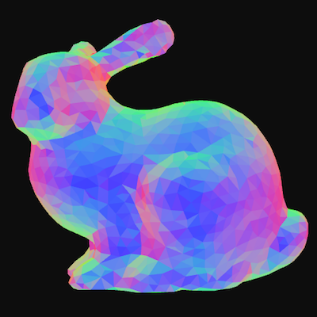

# gl-normal-material

[![NPM version][npm-image]][npm-url]
![experimental][experimental-image]
[![js-standard-style][standard-image]][standard-url]
[![material][material-image]][material-url]

Normal material for 3d rendering.

As defined in [`gl-material`](https://github.com/freeman-lab/gl-material), a `material` is a fragment shader and a set of styles with defaults. This material sets the RGB values of each vertex with the mesh's normal vector, which looks really cool and can also be useful for debugging. 

##### live [demo](http://gl-normal-material.surge.sh/)

--------------------------------------
> `STYLE PARAMETERS`

> `saturation` : `float` color saturation, 0 is white, 1 is full color, default `0.75`

> `absolute` : `bool` whether or not to take the absolute value, default `true`



## install

```
npm install gl-normal-material
```

## usage

Use with [`gl-material`](https://github.com/freeman-lab/gl-material) to generate a compiled shader, given a `gl` context

```javascript
var normal = require('gl-normal-material')
var material = require('gl-material')(gl, normal)
```

Or just get the fragment shader for use elsewhere

```javascript
var fragment = require('gl-normal-material').fragment
```

[npm-image]: https://img.shields.io/badge/npm-v1.0.0-lightgray.svg?style=flat-square
[npm-url]: https://npmjs.org/package/gl-normal-material
[material-image]: https://img.shields.io/badge/gl--material-normal-lightgray.svg?style=flat-square
[material-url]: https://github.com/freeman-lab/gl-material
[standard-image]: https://img.shields.io/badge/code%20style-standard-lightgray.svg?style=flat-square
[standard-url]: https://github.com/feross/standard
[experimental-image]: https://img.shields.io/badge/stability-experimental-lightgray.svg?style=flat-square
